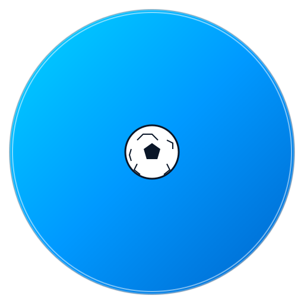

<p align="center">
	
</p>
<p align="center">
	<a href="https://react.dev">
		
	</a>
</p>
<p align="center">
	<strong>Soccer tournament management, built for clarity and momentum.</strong>
</p>

# GoalGrid
Soccer tournament management, built for clarity and momentum.

GoalGrid is a full-stack tournament companion that helps you organize teams, simulate matches, and follow bracket progression with confidence. It was inspired by a love for football and a desire to build a polished, real-world application end to end.

## Highlights
- Dashboard view for teams and tournament stats
- Bracket visualization to track progression
- Match simulation with results that feed the bracket
- Team management for creating, editing, and removing squads
- Match history for completed fixtures
- Responsive, user-friendly UI

## Feature Roadmap
- Player management with performance tracking
- Kit management (home/away colors)
- Manager profiles for teams
- Import and export tournaments for reuse
- User accounts for personal tournaments
- Real-time updates for live results
- Advanced simulation inputs (form, weather, player impact)
- Mobile app companion

## Tech Stack
- **Frontend:** React, Tailwind CSS, React Router
- **Backend:** Spring Boot, JPA/Hibernate, PostgreSQL or MongoDB
- **Testing:** Jest, React Testing Library, JUnit
- **Deployment:** Docker, AWS
- **Tooling:** Git, Postman, Swagger

## Getting Started
1) Clone the repository.
2) Open a terminal at the project root.
3) Install dependencies:
```
npm install
```
4) Build the app:
```
npm run build
```
5) Start the dev server:
```
npm run dev
```
Open `http://localhost:2932/` in your browser.

## Why This Project
- A personal passion project rooted in football
- A full-stack challenge to sharpen architecture and UX skills
- A playground for bracket logic, data integrity, and simulation design

## Lessons Learned
- State management is critical when brackets and simulations interact
- Data consistency demands clear validation and error handling
- Responsive design needs planning, not just styling
- Testing is essential for confidence in complex flows

## Contributing and Feedback
Suggestions are welcome. If you have ideas or spot issues, please open an issue or reach out.

## Author
**Lisa Zumana**


